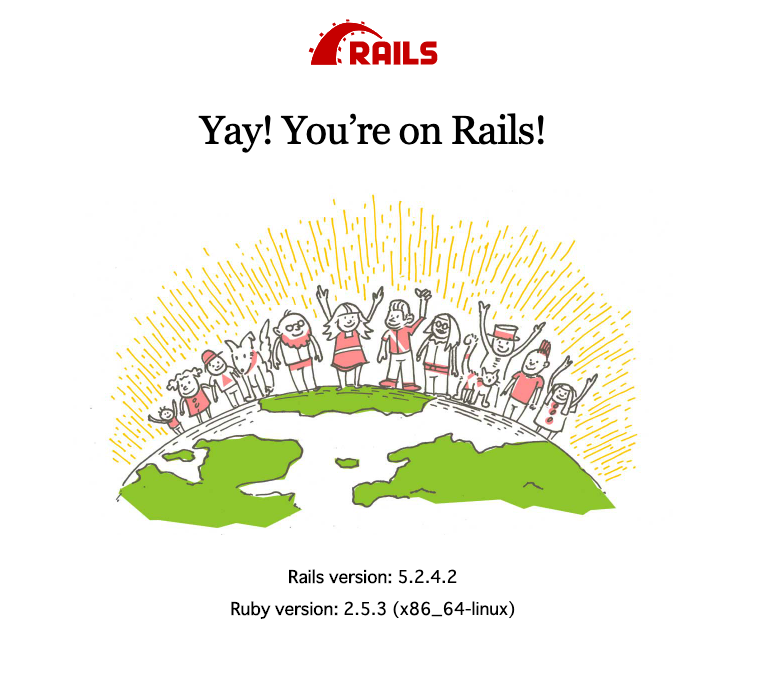

# Ruby on Rails環境構築の手順

http://localhost:3000/
にアクセスして、



の画像を表示させることがゴールです。

Dockerを使い、ローカル環境にRuby on Railsの環境構築する手順を記していきます。

## 1.ローカル環境を作成・移動
ローカル環境に作業ディレクトリを作る。
```
mkdir sampleapp
cd sampleapp
```

## 2.git clone
ローカル環境にデータを持ってくる
```
git clone
```

## 3.Docker起動
docker-composeコマンドで、コンテナを作成し、起動します。
```
docker-compose build
docker-compose up
```

## 4.Database作成
docker-composeコマンドで、DBを作成し、起動します。
```
docker-compose run web rails db:create
```

## 5.サーバーの起動を確認
ブラウザを開き、http://localhost:3000/
にアクセスする

# 補足

## Dockerコマンド
```
docker-compose ps
```
で、dockerコンテナの状態が分かります。
```
  Name                  Command              State             Ports
--------------------------------------------------------------------------------
sampleapp_db_1    docker-entrypoint.sh         Exit 255   3306/tcp, 33060/tcp
                  mysqld
sampleapp_web_1   rails s -p 3000 -b 0.0.0.0   Exit 255   0.0.0.0:3000->3000/tcp
```
Stateの部分が、
Upであればコンテナは作動しています。
Exitであればコンテナは停止しています。

```
docker-compose start
```
で停止状態のコンテナを再開できます。

```
docker-compose stop
```
でコンテナを停止状態にできます。

```
docker-compose down
```
でコンテナを削除できます。
コンテナを削除した場合は、
```
docker-compose up
```
でコンテナを作成し、起動できます。